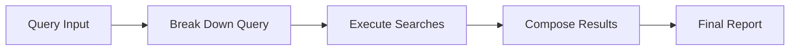

# SearchBot: Advanced Multi-Query Research Assistant

## Overview
SearchBot is an intelligent research assistant that breaks down complex queries into multiple sub-queries, performs parallel searches, and synthesizes the results into a comprehensive analytical report. It uses LangGraph for workflow management, Tavily for web searches, and GPT-4 for query analysis and result synthesis.

## Architecture

### 1. Core Components

#### StateGraph Workflow


#### State Management
The `SearchState` TypedDict manages the workflow state:
- `original_query`: Initial user query
- `topic`: Main research topic
- `sub_queries`: Generated search queries
- `search_results`: Results from all searches
- `final_context`: Synthesized analysis
- `error`: Error tracking

### 2. Key Components

#### Query Breakdown (`_break_down_query`)
- Takes complex queries and breaks them into focused sub-queries
- Uses GPT-4 to generate 3 distinct search angles
- Ensures comprehensive coverage of the topic
- Returns structured sub-queries for parallel processing

#### Search Execution (`_execute_searches`)
- Processes each sub-query through Tavily API
- Features:
  - Query cleaning (removes numbering, quotes)
  - Domain filtering (edu, org, gov)
  - Advanced search depth
  - Raw content inclusion
  - Relevance scoring
- Result processing and standardization

#### Result Composition (`_compose_results`)
- Synthesizes all search results into a comprehensive report
- Structured analysis sections:
  1. Introduction (Úvod)
  2. Methodology (Metodologie)
  3. Key Findings (Hlavní zjištění)
  4. Detailed Analysis (Detailní analýza)
  5. Practical Implications (Praktické implikace)
  6. Recommendations (Doporučení)
  7. Conclusion (Závěr)

### 3. Integration Components

#### API Clients
- **Tavily Client**: Web search integration
- **OpenAI Client**: GPT-4 for analysis
- Both initialized with environment variables

#### Interactive Interface
- Command-line interface for direct interaction
- Formatted output with:
  - Search progress indicators
  - Document summaries
  - Analytical reports
  - Follow-up suggestions

## Usage

### Basic Usage
```python
from searchbot import SearchBot

# Initialize
search_bot = SearchBot()

# Single search
result = search_bot.search_for_context(
    topic="classroom management",
    question="How to handle disruptive students?"
)

# Interactive mode
if __name__ == "__main__":
    interactive_search()
```

### Environment Setup
Required environment variables:
```env
TAVILY_API_KEY=your-tavily-api-key
OPENAI_API_KEY=your-openai-api-key
```

## Output Format

### 1. Search Results
For each sub-query:
- Query context
- Document details:
  - Title
  - Source URL
  - Relevance score
  - Key content excerpts

### 2. Analytical Report
Structured sections with:
- Context and relevance
- Methodology overview
- Key findings and patterns
- Detailed analysis
- Practical implications
- Actionable recommendations
- Conclusions and outlook

## Error Handling

- Query breakdown failures
- Search execution errors
- Result composition issues
- API communication errors
- State management errors

## Best Practices

1. **Query Formation**
   - Be specific in topic definition
   - Include context in questions
   - Use clear, searchable terms

2. **Result Analysis**
   - Review sub-queries for coverage
   - Check source diversity
   - Validate relevance scores

3. **Report Utilization**
   - Focus on practical implications
   - Consider multiple viewpoints
   - Follow up on open questions

## Technical Details

### Dependencies
- langgraph
- tavily-python
- langchain-openai
- python-dotenv
- pydantic

### Performance Considerations
- Parallel search execution
- Content chunking for processing
- Relevance-based result sorting
- Error recovery mechanisms

## Future Enhancements

Potential improvements:
1. Result caching
2. Advanced filtering options
3. Export capabilities (PDF/HTML)
4. Source verification
5. Interactive result exploration 