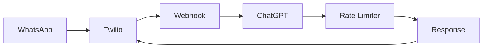

# Twilio WhatsApp ChatGPT Bot

A simple WhatsApp bot that uses ChatGPT to respond to messages through Twilio's API.

## Overview

This bot allows users to:
- Send messages through WhatsApp
- Get AI-powered responses from ChatGPT
- Maintain conversation context
- Handle rate limiting gracefully

## Prerequisites

- Python 3.9+
- Twilio Account
- OpenAI API Key
- ngrok

## Setup

1. Install dependencies:
```bash
pip install -r requirements.txt
```

2. Create `.env` file from template:
```bash
cp .env.example .env
```

3. Fill in your credentials:
```env
OPENAI_API_KEY=your-openai-api-key
TWILIO_ACCOUNT_SID=your-account-sid
TWILIO_AUTH_TOKEN=your-auth-token
TWILIO_WHATSAPP_NUMBER=your-twilio-number
```

## Running the Bot

1. Start the bot:
```bash
python simple_bot.py
```

2. In a new terminal, start ngrok:
```bash
ngrok http 8000
```

3. Copy the HTTPS URL from ngrok output:
```
Forwarding https://xxxx-xx-xx-xxx-xx.ngrok-free.app -> http://localhost:8000
```

## Twilio Configuration

1. Go to [Twilio Console](https://console.twilio.com)
2. Navigate to WhatsApp > Senders
3. Find your WhatsApp Sandbox
4. Set "When a message comes in" webhook to:
   ```
   https://your-ngrok-url/webhook
   ```
   - Method: POST

## Testing the Bot

1. Join your WhatsApp Sandbox:
   - Send "join <your-sandbox-code>" to +14155238886
   - You'll find your sandbox code in Twilio Console

2. Start chatting!
   - The bot will respond using ChatGPT
   - Maintains conversation history
   - Uses emojis and friendly language

## Features

### Rate Limiting
- 20 requests per minute
- Friendly fallback responses
- Rotating messages when rate limited

### Conversation Management
- Maintains context per user
- Stores last 10 messages
- Uses last 3 messages for context

### Error Handling
- Graceful error responses
- Debug logging
- Request validation

## Endpoints

- `GET /health` - Health check
- `GET /test` - Test bot is running
- `POST /webhook` - Twilio webhook endpoint

## Environment Variables

```env
OPENAI_API_KEY=           # Your OpenAI API key
TWILIO_ACCOUNT_SID=       # Twilio Account SID
TWILIO_AUTH_TOKEN=        # Twilio Auth Token
TWILIO_WHATSAPP_NUMBER=   # Twilio WhatsApp number
```

## Troubleshooting

### Common Issues

1. **502 Bad Gateway**
   - Check if bot is running
   - Verify ngrok connection
   - Test health endpoint

2. **Message Not Delivered**
   - Verify webhook URL in Twilio
   - Check Twilio logs
   - Ensure sandbox is joined

3. **Rate Limiting**
   - Wait 1 minute
   - Check OpenAI quota
   - Monitor request logs

### Debug Mode

Enable detailed logging:
```python
logging.basicConfig(level=logging.DEBUG)
```

## Architecture



## Best Practices

1. **Rate Limiting**
   - Keep under 20 req/min
   - Use fallback responses
   - Implement backoff

2. **Message Handling**
   - Validate input
   - Check message length
   - Handle media types

3. **Security**
   - Use environment variables
   - Validate webhooks
   - Sanitize input

## Contributing

1. Fork the repository
2. Create feature branch
3. Submit pull request

## License

MIT License 