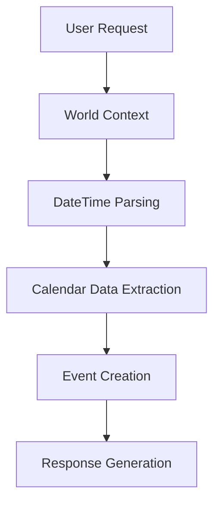

# ZapierBot: Intelligent Calendar Event Assistant

## Overview
ZapierBot is a sophisticated natural language calendar assistant that processes user requests, understands temporal expressions, and creates calendar events through Zapier integration. It uses LangGraph for workflow orchestration, GPT-4 for natural language understanding, and advanced date/time parsing for accurate event scheduling.

## Architecture

### 1. Core Components

#### State Management


#### Data Models
1. **WorldState**
   - Manages current time context
   - Handles timezone awareness (Europe/Prague)
   - Provides relative date parsing

2. **ZapierState** (TypedDict)
   ```python
   {
       "original_request": str,
       "world_context": Dict,
       "parsed_datetime": Optional[Dict],
       "calendar_data": Dict,
       "action_results": List[Dict],
       "final_response": str,
       "error": Optional[str]
   }
   ```

3. **CalendarEventData** (Pydantic Model)
   - Validates event data structure
   - Handles format conversion
   - Ensures data integrity

### 2. Workflow Stages

#### 1. World Context Collection (`_get_world_context`)
- Gets current date/time
- Determines timezone
- Checks weekend/weekday status
- Provides temporal context for parsing

#### 2. DateTime Parsing (`_parse_datetime`)
- Uses parsedatetime library
- Handles relative expressions:
  - "tomorrow at 2pm"
  - "next Wednesday"
  - "in three hours"
- Fallback to dateutil.parser
- Timezone awareness

#### 3. Calendar Data Extraction (`_extract_calendar_data`)
- Extracts event details:
  ```json
  {
      "summary": "Event title",
      "description": "Event description",
      "time_info": {
          "date": "YYYY-MM-DD",
          "time": "HH:MM",
          "duration_minutes": 60,
          "is_all_day": false
      },
      "location": "",
      "attendees": ["email@example.com"]
  }
  ```

#### 4. Event Creation (`_create_calendar_event`)
- Formats data for Google Calendar API
- Sends to Zapier webhook
- Handles API responses
- Validates success

#### 5. Response Composition (`_compose_response`)
- Formats user-friendly response
- Includes event details:
  - Title
  - Time
  - Location
  - Attendees
  - Duration

### 3. Integration Points

#### Zapier Webhook
- Expects Google Calendar API format
- Handles event creation
- Returns success/failure status

#### GPT-4 Integration
- Natural language understanding
- Event detail extraction
- Time expression parsing
- Context-aware processing

### 4. Error Handling

1. **Validation Errors**
   - Data format validation
   - Required field checking
   - Format constraints

2. **API Errors**
   - Webhook communication
   - Response validation
   - Status code handling

3. **Parsing Errors**
   - DateTime parsing failures
   - Invalid time expressions
   - Timezone issues

## Usage

### Environment Setup
```env
OPENAI_API_KEY=your-openai-key
ZAPIER_CALENDAR_WEBHOOK=your-zapier-webhook
```

### Basic Usage
```python
from zapierbot import ZapierBot

bot = ZapierBot()
result = bot.process_request(
    "Schedule a meeting with John tomorrow at 2pm for an hour"
)
```

### Interactive Mode
```bash
python zapierbot.py
```

### Example Commands
```
- Create a meeting with john@example.com tomorrow at 2pm for 1 hour
- Schedule team sync next Wednesday at 10am
- Add lunch meeting on Friday at noon
```

## Best Practices

### 1. Time Expressions
- Be specific with times
- Include duration if non-standard
- Specify timezone if different

### 2. Event Details
- Include clear title
- Specify attendees with emails
- Add location when relevant

### 3. Error Handling
- Check response success
- Verify event creation
- Monitor webhook status

## Dependencies
- langchain-openai
- langgraph
- parsedatetime
- python-dateutil
- pytz
- requests
- pydantic

## Future Enhancements
1. Recurring event support
2. Calendar availability checking
3. Multi-calendar support
4. Meeting link generation
5. Attendee availability check
6. Natural language confirmation 